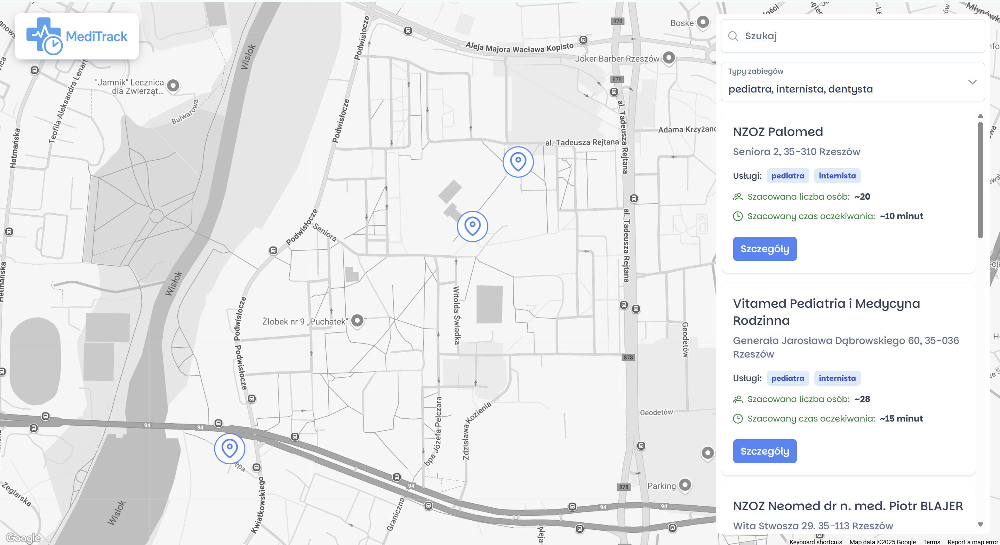

# HackCarpathia 2025

A web application that allows monitoring of queues and traffic levels in medical clinics across Rzeszów. Thanks to real-time data collection, it helps patients better plan their visits and avoid long waiting times.

Features:

- Display of basic information about a medical facility (address, phone number, available specialists)
- Real-time preview of the number of patients in clinics
- Filtering and searching facilities based on available medical services
- Estimating wait times for appointments
- Anonymous data collection by scanning Bluetooth signals
- Analysis of historical and current data
- Forecasting traffic intensity at different times of day
- Suggestions for less crowded facilities and convenient appointment times

## frontend

The frontend was developed using `Angular` v19, incorporating `Google Maps` for location-based features and the `NG Prime` component library to create an intuitive and user-friendly interface.
