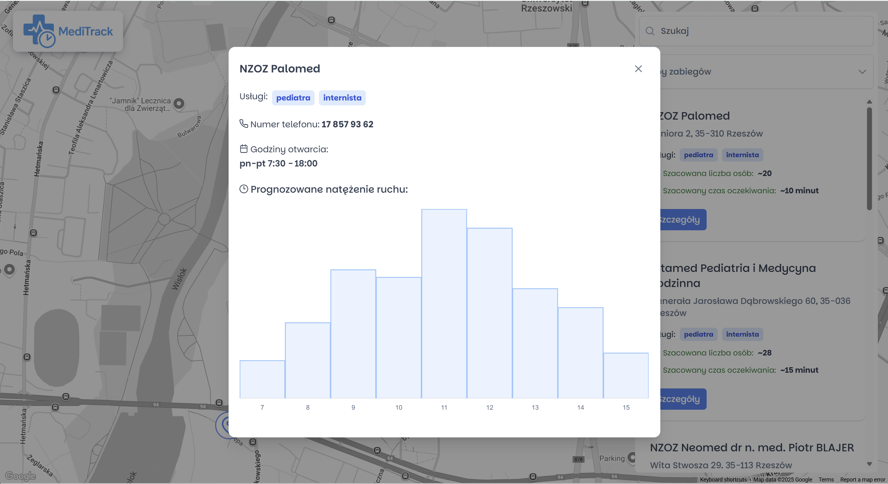

<<<<<<< HEAD
# MediTrack (HackCarpathia 2025)


A web application that allows monitoring of queues and traffic levels in medical clinics across Rzeszów. Thanks to real-time data collection, it helps patients better plan their visits and avoid long waiting times.

Features:

- Display of basic information about a medical facility (address, phone number, available specialists)
- Real-time preview of the number of patients in clinics
- Filtering and searching facilities based on available medical services
- Estimating wait times for appointments
- Anonymous data collection by scanning Bluetooth signals
- Analysis of historical and current data
- Forecasting traffic intensity at different times of day
- Suggestions for less crowded facilities and convenient appointment times

## Project Architecture

- frontend - Angular 19, NG Prime, Google Maps, Angular Query
- backend: .NET C#,
- hardware: gateway for scanning bluetooth devices

## Screenshots from app:



=======


## Custom embedded linux system

### Build
```
repo init -u https://github.com/Galaktyczne-Bambiki/HackCarpathia2025.git -b embedded -m embedded/linux/default.xml
repo sync -j$(nproc)
source sources/oe-core/oe-init-build-env build

cd embedded/linux
./setup-environment build
source sources/oe-core/oe-init-build-env build
bitbake medilab-image
```
